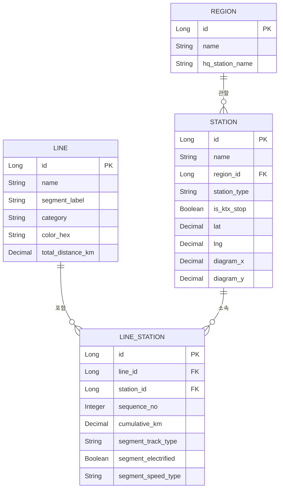

# 02. 데이터 모델 설계

전제: `01-requirements.md`에서 확정된 범위(전체 107개 노선, 전체 역/시설, 내부 도구)를 기준으로 설계한다.

## 1. 설계 원칙

- 원본 지도는 **노선(named line) → 역(station) 순서 → 역간 거리(km)** 구조로 정보를 담고 있다. 데이터 모델도 이 구조를 그대로 반영한다.
- 지리적 위경도는 참고용으로만 남기고, **도식화(노선도) 렌더링에 쓰는 좌표는 별도 필드**로 분리한다. 실제 좌표 계산/배치는 Phase 4(프론트엔드 시각화)에서 다룬다.
- 역 하나가 여러 노선에 속할 수 있다(환승역) → 역과 노선은 **다대다** 관계이며, 그 관계 자체(순서, 누적거리, 구간 속성)가 핵심 데이터다.
- 원본 범례의 역 종류·선로 종류 표기를 최대한 보존하되, 이미지만으로 의미가 애매한 부분은 **가정으로 명시**하고 Phase 2(데이터 구축)에서 실제 사례를 보며 검증한다.

## 2. 핵심 엔티티

### 2.1 Region (운영본부)

지도 좌측 하단 및 각지에 표기된 관할 본부(서울본부, 수도권서부본부, 수도권동부본부, 강원본부, 충북본부, 경북본부, 대전충남본부, 전북본부, 광주본부, 전남본부, 대구본부, 부산경남본부 등).

| 필드 | 타입 | 설명 |
|---|---|---|
| id | Long (PK) | |
| name | String | 본부명 (예: "서울본부") |
| hq_station_name | String, nullable | 본부 표기에 괄호로 병기된 소재지/거점역 (예: "서울본부(서울)"의 "서울") |

> 본부는 노선이 아니라 **역**을 기준으로 관할이 나뉘는 것으로 보이므로, Region은 Station에 연결한다(2.3 참고). 한 노선이 여러 본부를 가로지르는 것은 정상이다.

### 2.2 Line (노선)

지도 하단 "주요노선 구간·거리" 표 및 지도 각지에 표기된 노선명 단위(경부선, 호남선, 경원선, 경의선, 경춘선, 중앙선, 태백선, 영동선, 경북선, 문경선, 서해선(홍성~대야), 서해선(대곡~원시), 각종 화물전용선·인입선 등). 총 107개.

| 필드 | 타입 | 설명 |
|---|---|---|
| id | Long (PK) | |
| name | String | 노선명 (예: "경부선"). 동일 명칭이 구간별로 나뉘는 경우(예: 서해선) `segment_label`로 구분 |
| segment_label | String, nullable | 동일 노선명이 물리적으로 나뉜 구간을 구분하는 라벨 (예: "홍성~대야", "대곡~원시") |
| category | Enum(`LineCategory`) | 고속철도 / 일반철도 / 광역전철 / 화물전용선 — UI 분류·색상 그룹핑용 (2.5 참고) |
| color_hex | String, nullable | 노선도 표시용 색상 (지하철 노선도처럼 노선별 고유색 부여, 원본 지도 색상과 반드시 같을 필요는 없음) |
| total_distance_km | Decimal, nullable | 노선 총 거리 (하단 표 또는 LineStation 누적거리에서 계산 가능, 캐시용) |
| remarks | String, nullable | |

### 2.3 Station (역/시설)

역뿐 아니라 신호소, 임시승강장 등 지도에 점으로 표기된 모든 지점을 포함한다.

| 필드 | 타입 | 설명 |
|---|---|---|
| id | Long (PK) | |
| name | String | 역명 (예: "서울", "동대구") |
| region_id | Long (FK → Region), nullable | 관할 본부 |
| station_type | Enum(`StationType`) | 관리역 / 직원배치역 / 배치역 / 위탁역 / 화물취급역 / 무인역 / 신호소 / 임시승강장 (2.5 참고) |
| is_ktx_stop | Boolean | 고속열차 정차역 여부 (station_type과 별개의 오버레이 플래그, 2.5 참고) |
| lat, lng | Decimal, nullable | 원본 지도 기준 참고용 지리 좌표(추후 확보 시 입력, 1차 구축 시 비워둬도 무방) |
| diagram_x, diagram_y | Decimal, nullable | 노선도(도식화) 렌더링용 좌표. Phase 4에서 채움 |
| remarks | String, nullable | |

> 같은 역명이 서로 다른 지점(관리 주체)에 존재할 가능성은 낮지만, 발견 시 `name` 뒤에 노선명을 병기하는 등 별도 처리 규칙을 Phase 2에서 정한다.

### 2.4 LineStation (노선-역 매핑 / 구간)

역과 노선의 다대다 관계이자, 핵심 데이터인 **순서·거리·구간 속성**을 담는 테이블. 지도 위 역과 역 사이에 적힌 km 숫자가 여기 들어간다.

| 필드 | 타입 | 설명 |
|---|---|---|
| id | Long (PK) | |
| line_id | Long (FK → Line) | |
| station_id | Long (FK → Station) | |
| sequence_no | Integer | 해당 노선 내 순서 (기점=1부터 증가) |
| cumulative_km | Decimal | 노선 기점으로부터의 누적 거리(km). 지도에 기점 기준 누적으로 표기된 경우 그대로, 구간별 거리만 있는 경우 누적 합산해서 산출 |
| segment_track_type | Enum(`TrackType`), nullable | 이 역에서 **다음 역까지** 구간의 선로 종류: 단선 / 복선 |
| segment_electrified | Boolean, nullable | 이 역에서 다음 역까지 구간의 전철화 여부(비전철 구간 표시용) |
| segment_speed_type | Enum(`SpeedType`), nullable | 이 역에서 다음 역까지 구간이 고속철도운행구간 / 광역전철운행구간 / 일반 중 무엇인지 |

- 두 역 사이의 실제 거리(km) = `다음 sequence_no의 cumulative_km - 현재 cumulative_km`
- `segment_*` 필드들은 "현재 역 → 다음 역" 구간에 대한 속성이므로, 노선의 마지막 역에서는 null
- 환승역 = 동일 `station_id`가 서로 다른 `line_id`로 2개 이상의 LineStation 행을 가짐 → 별도 테이블 없이 쿼리로 판별 (필요 시 조회 성능을 위해 `Station.is_transfer` 캐시 필드를 추후 추가 가능)

## 3. ERD (개略)

## 4. Enum 정의

### 4.1 StationType (역 종류)

원본 범례 확대 확인 결과 9종으로 정정(2025 초안 작성 시 "배치역"으로 잘못 기재했던 것을 바로잡음 — `신호장`과 `신호소`는 서로 다른 별개 기호): `MANAGED`(관리역, ◎), `KTX_STOP`(고속열차 정차역, 붉은 원 — 아래 4.2 참고), `STAFFED`(직원배치역, ○), `ENTRUSTED`(위탁역, 노란 원), `FREIGHT`(화물취급역, 초록 원), `UNMANNED`(무인역, 반흑반백 원), `SIGNAL_YARD`(신호장, ⊗ 흰 바탕), `SIGNAL_STATION`(신호소, ⊗ 반흑 바탕), `TEMPORARY_PLATFORM`(임시승강장, 검은 원)

### 4.2 is_ktx_stop (고속열차 정차역 여부)

> **확인됨 (강원본부 영동선 데이터로 검증)**: 원본 지도는 역 하나에 아이콘을 하나만 그리므로, "고속열차 정차역"(빨간 원)이 표시된 역은 그 아래 깔려있을 원래 역 종류(관리역 등)가 **가려져서 육안으로 보이지 않는다**. 따라서 `is_ktx_stop = true`인 역의 `station_type`은 지도만으로 확정할 수 없는 경우가 많다 — 이런 역은 데이터 구축 시 `station_type`을 최선 추정치로 채우고 `remarks`에 "고속열차 정차역 표시로 원 역종류 아이콘 가려짐, 추정치" 라고 남긴다.

### 4.3 TrackType (선로 종류)

`SINGLE`(단선), `DOUBLE`(복선)

### 4.4 SpeedType (운행구간 구분)

`GENERAL`(일반), `HIGH_SPEED`(고속철도 운행구간, 지도상 빨간선), `METRO`(광역전철 운행구간, 지도상 하늘색선)

### 4.5 LineCategory (노선 분류)

`HIGH_SPEED_RAIL`(고속철도), `CONVENTIONAL_RAIL`(일반철도), `METRO`(광역전철), `FREIGHT_ONLY`(화물전용선)

> **가정**: 원본 지도는 노선명 단위로 이 분류를 명시하지 않고, 구간(`segment_speed_type`)에 오버레이로 표시한다. `Line.category`는 데이터 구축 시 사람이 판단해서 채우는 **UI 분류용 메타데이터**이며, 필요하면 노선 하나가 실질적으로 여러 성격(예: 일부 구간은 광역전철, 일부는 일반)을 가질 수 있음을 감안해 대표 분류로만 사용한다.

## 5. 도식화 좌표 설계 메모

- `Station.diagram_x/diagram_y`는 지리 좌표를 변환한 값이 아니라, **지하철 노선도처럼 사람이(또는 레이아웃 알고리즘이) 정렬한 좌표**다.
- 환승역은 모든 소속 노선에서 **동일한 diagram_x/y 한 점**을 공유하는 것을 기본으로 한다(실제 지하철 노선도 관례와 동일). 노선이 급격히 꺾이는 지점을 표현하기 위한 "경유점(waypoint)"이 필요하면, 이후 `LineWaypoint` 테이블(line_id, sequence, x, y)을 추가하는 것으로 확장한다 — 1차 모델에는 포함하지 않는다.
- 좌표 산정 방식(수동 배치 vs 자동 레이아웃 알고리즘)은 Phase 4에서 결정한다. 데이터 모델은 어느 방식이든 값을 저장할 수 있도록 필드만 미리 마련해둔다.

## 6. 알려진 이슈 / 추후 확인 사항

- **분기 구조**: 일부 노선은 단순 직선 순서가 아니라 중간에 갈라지는 지선을 가질 수 있다(특히 화물전용선). 1차 모델은 `LineStation.sequence_no`로 **단순 선형 순서**만 표현하므로, 실제 분기가 발견되면 해당 분기를 별도의 `Line`(예: "경부선(지선)")으로 쪼개서 처리하는 것을 원칙으로 한다. 분기가 매우 많다고 판단되면 이 문서를 갱신해 `LineBranch` 개념을 추가한다.
- **기점 기준**: 누적거리(`cumulative_km`)의 기점(0km 지점)이 노선마다 다르므로, Phase 2 데이터 구축 시 노선별 기점역을 명확히 정하고 기록한다.
- **동일 역명 중복**: 서로 다른 위치에 동일한 역명이 존재하는 경우가 있는지 Phase 2에서 확인하고, 있다면 처리 규칙(예: 내부 코드로 구분)을 정한다.

## 7. 다음 단계

`docs/03-data-source.md`(원본 데이터 추출 규칙 및 데이터 구축 계획)로 진행한다.
