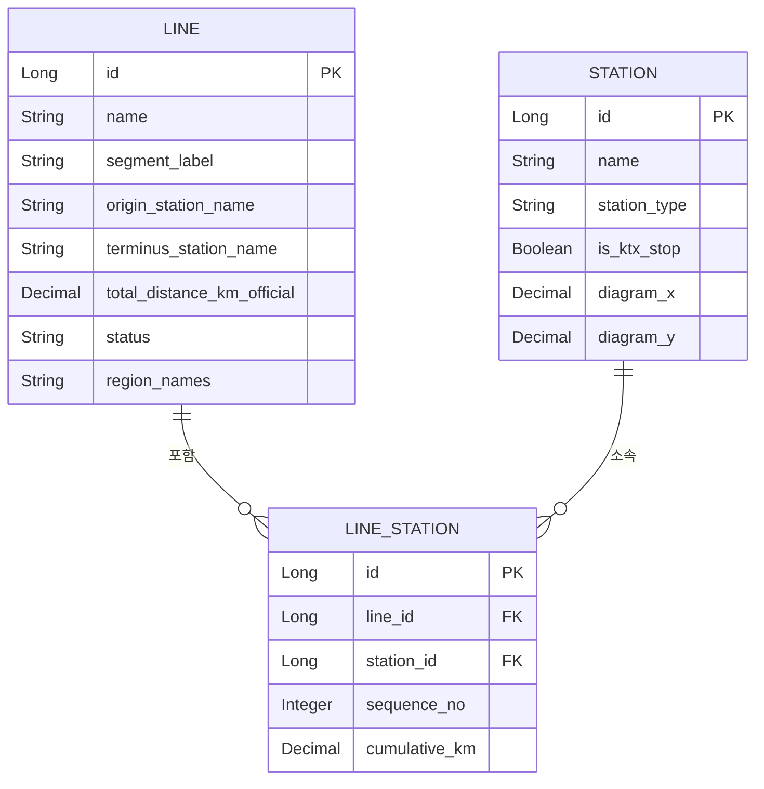

# 02. 데이터 모델 설계 (v2 — 실제 수집 데이터 반영, 단순화)

전제: `01-requirements.md`에서 확정된 범위(전체 노선, 전체 역/시설, 내부 도구)를 기준으로 설계한다.

> **v2 변경 사유**: Phase 2(데이터 구축, `data/raw/lines/*.json`)를 실제로 진행해보니 v1에서 설계했던 필드 중 일부(선로 속성, 노선 분류)는 원본 자료에서 끝내 확보되지 않았고, 본부(Region)는 역 단위가 아니라 노선 단위로만 파악됐다. 이 문서는 **실제로 존재하는 데이터를 기준으로 다시 설계**했고, 서비스의 핵심 목적(**역을 검색하면 어느 노선(들)에 속하는지 확인**)에 집중한다. KTX 정차 여부 등은 부가 정보일 뿐, 화물전용선을 포함한 모든 노선이 "이 역이 어느 노선인지" 조회 대상이라는 점을 전제로 한다.

## 1. 설계 원칙

- 핵심 목적은 **역 검색 → 소속 노선(들) 확인**이다. 나머지(역 종류, KTX 정차 여부, 선로 속성 등)는 있으면 보여주는 부가 정보이며, 없어도(null이어도) 핵심 기능은 동작해야 한다.
- 역 하나가 여러 노선에 속할 수 있다(환승역/분기역) → 역과 노선은 **다대다** 관계이며, 그 관계 자체(순서, 누적거리)가 핵심 데이터다.
- 지리적 위경도는 참고용으로만 남기고, **도식화(노선도) 렌더링에 쓰는 좌표는 별도 필드**로 분리한다. 실제 좌표 계산/배치는 Phase 4(프론트엔드 시각화)에서 다룬다.
- 실제 수집 데이터에 없는 필드는 모델에 넣지 않는다. 필요해지면 그때 추가한다(YAGNI).

## 2. 핵심 엔티티

### 2.1 Line (노선)

`data/raw/lines/*.json` 파일 하나가 Line 하나(또는 `segmentLabel`로 구분되는 구간 하나)에 대응한다.

| 필드 | 타입 | 설명 |
|---|---|---|
| id | Long (PK) | |
| name | String | 노선명 (예: "경부선") |
| segment_label | String, nullable | 동일 노선명이 물리적으로 나뉜 구간을 구분하는 라벨 (예: 서해선의 "대곡-원시" / "서화성-홍성") |
| origin_station_name | String, nullable | 기점역 이름 (표시용, `LineStation.sequence_no = 1`에서 유도 가능하지만 조회 편의상 보관) |
| terminus_station_name | String, nullable | 종점역 이름 (표시용) |
| total_distance_km_official | Decimal, nullable | 공식 총거리(위키백과/지도 표기 기준) |
| status | Enum(`LineStatus`) | 운행 상태: `OPERATING`(기본값) / `CLOSED`(폐선) / `SUSPENDED`(여객중지) / `UNBUILT`(미개통) |
| region_names | String, nullable | 이 노선이 지나는 관할 본부 이름들을 콤마 등으로 이어붙인 텍스트(예: "강원본부,경북본부"). 본부 단위 필터링용 정보이며 역 단위 소속은 아님(2.4 참고) |
| remarks | String, nullable | |

> **category(고속철도/일반철도/광역전철/화물전용선) 필드는 MVP에서 제외한다.** Phase 2에서 실제로 채운 적이 없고, 화물전용선도 동등하게 조회 대상이므로 노선 분류로 검색 결과를 걸러낼 필요가 당장은 없다. 필요해지면 나중에 추가한다.

### 2.2 Station (역/시설)

역명은 여러 노선 파일에 걸쳐 재사용된다(같은 이름이면 같은 물리적 지점으로 간주). DB 적재 시 이름 기준으로 중복 제거해 하나의 Station 레코드로 합친다.

| 필드 | 타입 | 설명 |
|---|---|---|
| id | Long (PK) | |
| name | String, unique | 역명 (예: "서울", "동대구") |
| station_type | Enum(`StationType`), nullable | 관리역/직원배치역/위탁역/화물취급역/무인역/신호장/신호소/임시승강장. 수집 데이터에 없는 역이 많아 nullable |
| is_ktx_stop | Boolean, default false | 고속열차 정차역 여부(확인된 경우만 true) |
| diagram_x, diagram_y | Decimal, nullable | 노선도(도식화) 렌더링용 좌표. Phase 4에서 채움 |
| lat, lng | Decimal, nullable | 참고용 지리 좌표(현재 미수집) |
| remarks | String, nullable | |

> **본부(Region)는 Station에 붙이지 않는다.** 실제로 확보한 데이터는 "이 노선이 어느 본부들을 지나는가"뿐이고, "이 역이 정확히 어느 본부 소속인가"는 확보하지 못했다. 역 단위 본부 정보가 필요해지면 Phase 3 이후 별도 보강 작업으로 진행한다.

### 2.3 LineStation (노선-역 매핑 / 구간)

역과 노선의 다대다 관계이자, 핵심 데이터인 **순서·누적거리**를 담는 테이블.

| 필드 | 타입 | 설명 |
|---|---|---|
| id | Long (PK) | |
| line_id | Long (FK → Line) | |
| station_id | Long (FK → Station) | |
| sequence_no | Integer | 해당 노선 내 순서 (기점=1부터 증가) |
| cumulative_km | Decimal, nullable | 노선 기점으로부터의 누적 거리(km). 미개통 역 등 일부는 null 가능(예: 수인선 학익역) |
| remarks | String, nullable | 판독/정정 이력 등 |

- 두 역 사이의 실제 거리(km) = `다음 sequence_no의 cumulative_km - 현재 cumulative_km`
- 환승역/분기역 = 동일 `station_id`가 서로 다른 `line_id`로 2개 이상의 LineStation 행을 가짐 → 별도 테이블 없이 쿼리로 판별

> **선로 속성(단선/복선/전철화 여부/고속·광역 운행구간)은 MVP에서 제외한다.** 68개 노선 어디에서도 이 값을 실제로 수집하지 못했다. 필요해지면 별도 보강 작업으로 `LineStation`에 컬럼을 추가한다.

## 3. ERD

## 4. Enum 정의

### 4.1 StationType (역 종류)

원본 범례 9종: `MANAGED`(관리역, ◎), `STAFFED`(직원배치역, ○), `ENTRUSTED`(위탁역, 노란 원), `FREIGHT`(화물취급역, 초록 원), `UNMANNED`(무인역, 반흑반백 원), `SIGNAL_YARD`(신호장, ⊗ 흰 바탕), `SIGNAL_STATION`(신호소, ⊗ 반흑 바탕), `TEMPORARY_PLATFORM`(임시승강장, 검은 원). (참고: "고속열차 정차역"은 `StationType`이 아니라 `Station.is_ktx_stop` 별도 플래그로 표현 — 4.2 참고)

### 4.2 is_ktx_stop

지도상 "고속열차 정차역"(빨간 원) 표시는 역 하나에 아이콘을 하나만 그리는 방식이라 원래 역 종류 아이콘을 가리는 경우가 많았다. 그래서 `is_ktx_stop=true`인 역이라도 `station_type`은 추정치이거나 null일 수 있다. 확정된 값이 아니면 `remarks`에 근거를 남긴다.

### 4.3 LineStatus (노선 운행 상태)

`OPERATING`(정상 운행, 기본값), `CLOSED`(완전 폐선), `SUSPENDED`(여객 영업 중지, 선로는 존재), `UNBUILT`(아직 준공/미개통). Phase 2 데이터 수집 중 실제로 4가지 상태가 모두 발견됨(예: 군산화물선=CLOSED, 문경선·진해선=SUSPENDED, 동해북부선=UNBUILT).

## 5. 도식화 좌표 설계 메모

- `Station.diagram_x/diagram_y`는 지리 좌표를 변환한 값이 아니라, **지하철 노선도처럼 사람이(또는 레이아웃 알고리즘이) 정렬한 좌표**다.
- 환승역은 모든 소속 노선에서 **동일한 diagram_x/y 한 점**을 공유하는 것을 기본으로 한다. 좌표 산정 방식은 Phase 4에서 결정한다.

## 6. 알려진 이슈 / 추후 확인 사항

- **역 단위 본부(Region) 정보 없음**: `Line.region_names`로 "이 노선이 지나는 본부들"은 알 수 있지만, 개별 역이 어느 본부 소속인지는 모른다. 화면에 필요하면 나중에 보강.
- **선로 속성·노선 분류 없음**: 단선/복선, 전철화 여부, 고속철도/일반철도/광역전철 분류는 이번 데이터에 없다. 검색 결과 필터링에 필요해지면 그때 추가로 조사한다.
- **분기 구조**: 일부 노선(특히 화물전용선)은 단순 직선 순서가 아니라 중간에 갈라질 수 있다. 현재 모델은 `LineStation.sequence_no`로 단순 선형 순서만 표현한다. 실제 분기가 문제되면 그때 `LineBranch` 개념을 추가한다.
- **동일 역명 중복**: 서로 다른 위치에 동일한 역명이 존재하는 경우는 발견되지 않았으나, DB 적재 시 이름 기준 병합 과정에서 재확인이 필요하다.

## 7. 다음 단계

이 모델을 기준으로 `docs/04-api-design.md`를 이 v2에 맞춰 재확인한 뒤, Phase 3(백엔드 구현: JPA 엔티티, `data/raw/lines/*.json`을 읽는 DB 시더, 역 검색/노선 조회 REST API)를 진행한다.
